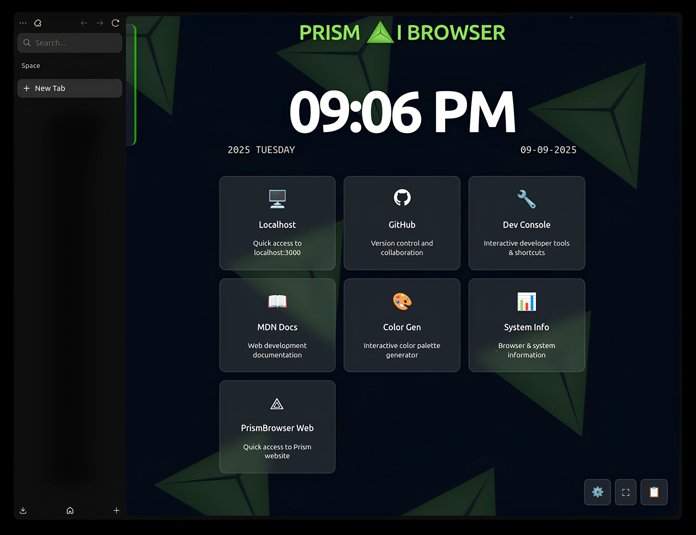
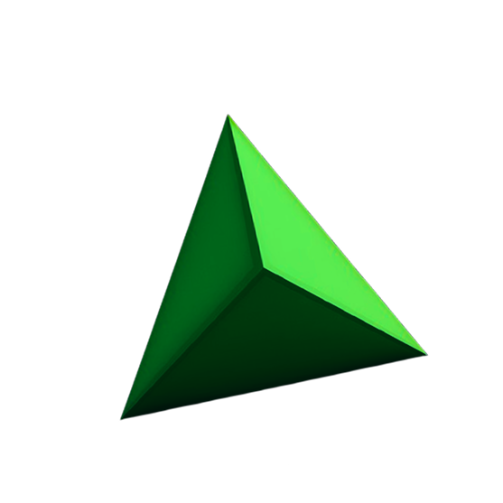

# ⚡ Prism Web

<div align="center">
  
  
  <h3>🚀 Where AI Meets Browser 🚀</h3>
  
  [](https://nextjs.org/)
  [](https://reactjs.org/)
  [](https://tailwindcss.com/)
  [](https://greensock.com/)
  
  <br/>
  
  [](https://github.com/NobinSijo7T/prism-web)
  [](LICENSE)
  [](https://github.com/NobinSijo7T/prism-web/stargazers)
  [](https://github.com/NobinSijo7T/prism-web/network)
</div>

---

## 📖 About Prism Web

**Prism Web** is a cutting-edge, visually stunning web application that showcases the future of browser technology. Built with modern web technologies, it demonstrates the perfect fusion of AI capabilities and browser functionality through an immersive, interactive user experience.

### ✨ Key Features

- 🎨 **Stunning Visual Effects** - Advanced 3D rendering and prismatic animations
- 🚀 **High Performance** - Optimized for speed and smooth interactions
- 📱 **Fully Responsive** - Perfect experience across all devices
- 🎯 **Interactive UI** - Custom cursor animations and dynamic elements
- 🌟 **Modern Design** - Clean, professional, and futuristic interface
- 🔒 **Privacy-First** - No data collection, no tracking, complete privacy
- ⚡ **Fast Loading** - Optimized assets and efficient code splitting

---

## 🎥 Demo & Screenshots

<div align="center">
  
  ### 🖥️ Desktop Experience
  
  
  ### 📱 Mobile Experience
  
  
</div>

---

## 🛠️ Tech Stack

<div align="center">

### Frontend Framework & Libraries

| Technology | Version | Purpose | Logo |
|------------|---------|---------|------|
| **Next.js** | 15.5.3 | React Framework |  |
| **React** | 19.1.0 | UI Library |  |
| **TypeScript** | Latest | Type Safety |  |
| **Tailwind CSS** | Latest | Styling |  |

### Animation & 3D Libraries

| Technology | Version | Purpose | Logo |
|------------|---------|---------|------|
| **GSAP** | Latest | Advanced Animations |  |
| **Three.js** | Latest | 3D Graphics |  |
| **React Three Fiber** | Latest | React 3D |  |
| **React Three Drei** | Latest | 3D Helpers |  |

### UI & Icons

| Technology | Version | Purpose | Logo |
|------------|---------|---------|------|
| **Lucide React** | Latest | Icon Library |  |
| **React Icons** | Latest | Additional Icons |  |
| **Radix UI** | Latest | Headless Components |  |

### Development Tools

| Technology | Version | Purpose | Logo |
|------------|---------|---------|------|
| **ESLint** | Latest | Code Linting |  |
| **PostCSS** | Latest | CSS Processing |  |
| **Git** | Latest | Version Control |  |
| **GitHub** | Latest | Repository Hosting |  |

</div>

---

## 🚀 Quick Start

### Prerequisites

- **Node.js** (v18+ recommended)
- **npm**, **yarn**, **pnpm**, or **bun**

### Installation

```bash
# Clone the repository
git clone https://github.com/NobinSijo7T/prism-web.git

# Navigate to project directory
cd prism-web

# Install dependencies
npm install
# or
yarn install
# or
pnpm install
```

### Development

```bash
# Start development server
npm run dev
# or
yarn dev
# or
pnpm dev

# Open browser and navigate to
# http://localhost:3000
```

### Production Build

```bash
# Build for production
npm run build

# Start production server
npm run start
```

---

## 📁 Project Structure

```
prism-web/
├── 📁 app/                    # Next.js App Router
│   ├── 📄 page.js            # Homepage
│   ├── 📄 layout.js          # Root layout
│   ├── 📁 privacy/           # Privacy policy page
│   └── 📁 team/              # Team page
├── 📁 components/            # React components
│   ├── 📁 ui/                # Reusable UI components
│   ├── 📄 CardNav.jsx        # Navigation component
│   ├── 📄 Footer.jsx         # Footer component
│   ├── 📄 TargetCursor.jsx   # Custom cursor
│   └── 📄 ...               # Other components
├── 📁 public/               # Static assets
│   ├── 🖼️ nav-logo.png      # Logo
│   ├── 🎥 laserflow.mp4     # Background video
│   └── 🖼️ ...              # Other assets
├── 📁 lib/                  # Utility functions
└── 📄 package.json         # Dependencies
```

---

## 🎨 Design Philosophy

<div align="center">

### 🎨 Color Palette

| Color | Hex | Usage |
|-------|-----|-------|
| **Prism Green** | `#88E755` | Primary brand color |
| **Dark Background** | `#060010` | Main background |
| **Light Text** | `#FFFFFF` | Primary text |
| **Accent Colors** | Various | Interactive elements |

</div>

---

## 📊 Performance Metrics

<div align="center">


</div>

---

## 🤝 Contributing

We welcome contributions! Here's how you can help:

1. **🍴 Fork** the repository
2. **🔀 Create** a feature branch (`git checkout -b feature/AmazingFeature`)
3. **💾 Commit** your changes (`git commit -m 'Add some AmazingFeature'`)
4. **📤 Push** to the branch (`git push origin feature/AmazingFeature`)
5. **🔄 Open** a Pull Request

### 👥 Our Team

| Member | Role | GitHub | Color Theme | Contributions |
|--------|------|--------|-------------|---------------|
| **Johan** | Lead Developer | [@johan](https://github.com/johan) |  `#374151` |  |
| **Aljo** | Frontend Developer | [@aljo](https://github.com/aljo) |  `#f5dd42` |  |
| **Rohith** | UI/UX Designer | [@rohith](https://github.com/rohith) |  `#4bf542` |  |
| **Nasih** | Backend Developer | [@nasih](https://github.com/nasih) |  `#4260f5` |  |
| **Nazeem** | DevOps Engineer | [@nazeem](https://github.com/nazeem) |  `#064E3B` |  |

---

## 📞 Contact & Support

<div align="center">

### 💬 Get in Touch

[](https://discord.gg/prism)
[](mailto:prismaibrowser@gmail.com)
[](https://github.com/Prismaibrowser)

### 🌐 Social Media

[](https://x.com/prismweb)
[](https://youtube.com/@prismweb)
[](https://instagram.com/prismweb)
[](https://reddit.com/r/prismweb)
[](https://linkedin.com/company/prismweb)

</div>

---

## 📈 Repository Stats

<div align="center">


[](https://github.com/NobinSijo7T/prism-web)

### 📈 Contributors Activity

<div align="center">

[](https://github.com/NobinSijo7T/prism-web/graphs/contributors)

#### Individual Contributor Stats

| Contributor | Commits | Lines Added | Lines Removed | Files Changed |
|-------------|---------|-------------|---------------|---------------|
|  **Johan** | ].total&label=commits&color=374151) | ].weeks[*].a&label=added&color=4bf542) | ].weeks[*].d&label=deleted&color=f54242) |  |
|  **Aljo** | ].total&label=commits&color=f5dd42) | ].weeks[*].a&label=added&color=4bf542) | ].weeks[*].d&label=deleted&color=f54242) |  |
|  **Rohith** | ].total&label=commits&color=4bf542) | ].weeks[*].a&label=added&color=4bf542) | ].weeks[*].d&label=deleted&color=f54242) |  |
|  **Nasih** | ].total&label=commits&color=4260f5) | ].weeks[*].a&label=added&color=4bf542) | ].weeks[*].d&label=deleted&color=f54242) |  |
|  **Nazeem** | ].total&label=commits&color=064E3B) | ].weeks[*].a&label=added&color=4bf542) | ].weeks[*].d&label=deleted&color=f54242) |  |

### 📊 Contribution Heatmap


</div>

</div>

---

## 🏆 Achievements & Milestones

<div align="center">

| 🎯 Milestone | ✅ Status | 📅 Date |
|-------------|-----------|---------|
| **Project Setup** | Complete | ✅ 2024 |
| **Core Features** | Complete | ✅ 2024 |
| **Mobile Optimization** | Complete | ✅ 2024 |
| **Performance Optimization** | Complete | ✅ 2024 |
| **Privacy Policy** | Complete | ✅ 2024 |
| **Team Page** | Complete | ✅ 2024 |

</div>

---

## 📝 License

This project is licensed under the **MIT License** - see the [LICENSE](LICENSE) file for details.

---

## 🙏 Acknowledgments

- **Next.js Team** for the amazing framework
- **Vercel** for hosting and deployment
- **GSAP** for powerful animations
- **Three.js** for 3D graphics capabilities
- **Tailwind CSS** for utility-first styling
- **Open Source Community** for inspiration and tools

---

<div align="center">

### 🌟 Star this repository if you found it helpful!

[](https://star-history.com/#NobinSijo7T/prism-web&Date)

---

**Made with ❤️ by the Prism Web Team**

</div>